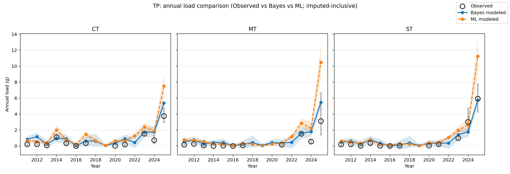

# Kerbel Long‑Term Impacts on Edge‑of‑Field Water Quality


**Principal Investigator**  
AJ Brown, Agricultural Data Scientist  
Colorado State University – Agricultural Water Quality Program (AWQP)

---

## Table of Contents
1. [Project Overview](#1-project-overview)
2. [Repository Organization](#2-repository-organization)
3. [End-to-End Data Pipeline](#3-end-to-end-data-pipeline)
4. [Bayesian Modeling Framework (Overview)](#4-bayesian-modeling-framework-overview)
5. [Machine Learning Modeling Framework (CatBoost + Conformal)](#5-machine-learning-modeling-framework-catboost--conformal)
6. [Key Results at a Glance](#6-key-results-at-a-glance)
7. [How to Reproduce Results](#7-how-to-reproduce-results)
8. [Output Data Products](#8-output-data-products)
9. [Related Documentation](#9-related-documentation)
10. [License and Citation](#10-license-and-citation)


---

## 1. Project Overview

This repository supports a **long‑term (2011–2025) edge‑of‑field (EoF) water‑quality analysis** at the Kerbel agricultural research site in Colorado. The project integrates:

- Event‑scale runoff **concentration**, **volume**, and **load** data
- Crop and tillage management records
- Seasonal and cumulative **Soil Tillage Intensity Rating (STIR)** metrics

Two complementary modeling approaches are implemented:

1. **Hierarchical Bayesian models** to quantify causal STIR effects and propagate uncertainty
2. **Machine learning models (CatBoost)** with conformal prediction to benchmark pattern‑learning performance

The repository is intentionally structured so both approaches operate on the **same processed datasets**, enabling transparent comparison of strengths and limitations.

---

## 2. Repository Organization

```
kerbel-long-term-impacts/
├── code/        # Python + R modeling and preprocessing scripts
├── data/        # Raw and intermediate datasets
├── docs/        # Detailed method and workflow documentation
├── figs/        # Publication‑ready figures
├── out/         # Final model outputs
├── README.md    # This file
```

Key subdirectories:
- `code/` contains both Bayesian (Stan/R) and ML (Python) workflows
- `docs/` contains extended READMEs linked throughout this file
- `out/` contains finalized CSV outputs used for analysis and figures

---

## 3. End‑to‑End Data Pipeline

The preprocessing pipeline is shared by both modeling approaches.

1. **Water‑quality longification**  
   `code/wq_longify.py`

2. **STIR calculation**  
   `code/stir_pipeline.py`  
   Details: [`docs/STIR calculations.md`](./docs/STIR%20calculations.md)

3. **Seasonal merge**  
   `code/merge_wq_stir_by_season.py`

4. **Pipeline runner**  
   ```bash
   python code/main.py --debug
   ```

Outputs are written to `out/` and serve as direct inputs to both Bayes and ML models.

---

## 4. Bayesian Modeling Framework (Overview)

The Bayesian analysis is the primary inferential framework for this project. It focuses on:

- Causal estimation of STIR effects
- Full uncertainty propagation
- Multi‑analyte hierarchical structure
- Temporal persistence using Gaussian Processes

📘 **Full Bayesian methods documentation:**  
➡️ [`docs/README_bayes_methods.md`](./docs/README_bayes_methods.md)

This separation keeps the main README concise while preserving methodological depth.

---

## 5. Machine Learning Framework (CatBoost + Conformal)

A parallel machine‑learning analysis is implemented using **CatBoost regression** with **Leave‑One‑Year‑Out (LOYO)** cross‑validation and **conformal prediction intervals**.

### Purpose of ML analysis
- Benchmark predictive performance against Bayesian models
- Evaluate strengths and weaknesses for long‑term environmental datasets
- Examine interpretability tradeoffs

### Key characteristics
- Separate models for log‑concentration and log‑volume
- Saved calibrated models reused for regeneration
- Prediction intervals derived from stored conformal quantiles
- Annual summaries regenerated without refitting

📘 **Detailed ML documentation:**  
➡️ [`docs/README_ML_CatBoost_Conformal_LOYO.md`](./docs/README_ML_CatBoost_Conformal_LOYO.md)

---

## 6. Key Results at a Glance

This study evaluates Bayesian and machine-learning approaches for estimating long-term annual nutrient and sediment loads using a combination of point-based and distribution-aware performance metrics. Although both frameworks achieve comparable accuracy for central estimates of annual loads, they differ fundamentally in how temporal structure, uncertainty, and management effects are represented. The Bayesian model explicitly encodes causal assumptions and temporal dependence, producing calibrated uncertainty that evolves with data availability, whereas the machine-learning model emphasizes flexible pattern recognition and interpolation. These differences are most clearly revealed by probabilistic performance metrics such as CRPS, while recognizing that all observation-based metrics implicitly treat measured loads as truth, despite substantial uncertainty in the load estimation process itself.

**Takeaway: similar point accuracy does not imply similar inferential value, and uncertainty-aware Bayesian models provide distinct advantages for long-term environmental decision-making, particularly when observations are noisy proxies of an unobserved true process.**

### Bayesian findings
- STIR exhibits strong, analyte-specific associations, with the largest and most consistent effects observed for particulate constituents (e.g., TP, TSS, OP, TKN), consistent with mechanistic expectations for sediment-associated transport.
- Dissolved species generally show weaker, more variable, or temporally inconsistent responses to tillage intensity, reflecting greater sensitivity to hydrologic and biogeochemical controls beyond surface disturbance alone.
- Temporal persistence is substantial for particulate analytes and is explicitly captured through a multi-output Gaussian process, resulting in coherent year-to-year trajectories rather than independent annual estimates.
- Bayesian imputation propagates uncertainty forward in time, producing widening annual load intervals in years with sparse or missing observations.
- Across analytes and treatments, Bayesian predictions exhibit well-calibrated uncertainty, with empirical interval coverage near nominal levels and lower CRPS values, indicating superior probabilistic alignment with observed loads even when point-estimate errors are comparable to ML.

### Machine-learning findings
- CatBoost models primarily learn analyte identity, inflow conditions, cumulative system state, and monitoring infrastructure effects, with feature importance dominated by hydrologic and structural covariates rather than management variables.
- STIR contributes to predictive skill but is not isolated as a dominant or interpretable driver, particularly for concentration, limiting causal attribution.
- Point prediction accuracy (RMSE and NRMSE) is generally comparable to Bayesian central estimates for many analytes, indicating reasonable performance for mean annual loads relative to observed values.
- Predictive performance degrades for extreme events and high-load years, with errors disproportionately driven by rare but influential observations.
- Conformal prediction intervals exhibit systematic under-coverage, particularly for runoff volume and particulate loads, and interval widths remain relatively static through time.
- As a result, ML-derived annual loads behave as smoothed reconstructions of observed patterns rather than temporally adaptive, uncertainty-aware estimates, a limitation reflected in higher CRPS values relative to the Bayesian model.

### Synthesis
- Bayesian models provide causal interpretability, temporal coherence, and principled uncertainty propagation, resulting in predictive distributions that are both calibrated and adaptive to data availability.
- Machine-learning models offer efficient pattern recognition and interpolation across complex covariate spaces but struggle with temporal generalization, extreme events, and uncertainty calibration when applied to long-term environmental monitoring data.
- While RMSE and NRMSE suggest broadly similar point-estimate accuracy between approaches, CRPS reveals substantial differences in probabilistic forecast quality, favoring the Bayesian framework; however, CRPS should be interpreted as measuring alignment with noisy observed loads rather than with the unobserved true environmental process.
- From a practical standpoint, machine-learning implementation imposes relatively low upfront labor on the analyst, as models can be trained by supplying a broad set of covariates and allowing the algorithm to infer relationships. In contrast, the Bayesian framework requires substantial prior effort, including explicit causal reasoning, structural assumptions, and thoughtful model specification. This additional investment increases development time but yields greater interpretability, transparency, and scientific insight once the model is executed.
- Together, these results demonstrate that ML models may be suitable for descriptive benchmarking or short-horizon interpolation, whereas Bayesian inference is required when uncertainty realism, temporal structure, and decision-relevant inference are primary objectives in environmental management, particularly in settings where observations are imperfect proxies for latent truth.

*Figure 1. Faceted annual load estimates comparing Bayesian and machine-learning approaches for total phosphorus (TP) under no-till management. Shaded intervals represent 90% credible/prediction intervals.*



### Summary of Key Differences Between Bayesian and Machine-Learning Approaches

| Dimension | Bayesian hierarchical modeling | Machine-learning (CatBoost + conformal) |
|--------|-------------------------------|-----------------------------------------|
| Primary objective | Inference on latent environmental processes with explicit uncertainty | Prediction of observed outcomes using flexible pattern recognition |
| Effort required to implement | High upfront effort, requires explicit causal reasoning, prior specification, and structural assumptions | Low upfront effort, can ingest many covariates with minimal manual feature engineering |
| Transparency and interpretability | High, model structure and parameters map directly to physical and management processes | Limited, relationships are implicit and distributed across trees |
| Treatment of time | Explicitly modeled using a multi-output Gaussian process, capturing temporal persistence and nonstationarity | Time treated as a covariate, no inherent temporal dependence or memory |
| Representation of uncertainty | Principled probabilistic uncertainty derived from model structure and data availability | Empirical uncertainty via conformal prediction, largely static through time |
| Honesty of uncertainty | Uncertainty widens naturally in data-sparse or missing periods, reflecting epistemic uncertainty | Uncertainty remains approximately constant, even when data are sparse |
| Predictive accuracy (point estimates) | Comparable RMSE and NRMSE for central estimates across most analytes | Comparable RMSE and NRMSE for central estimates across most analytes |
| Performance in extreme years | More robust, with wider uncertainty reflecting rare high-load events | Degraded performance, with extreme events driving disproportionate error |
| Distributional performance | Lower CRPS and near-nominal coverage, indicating well-calibrated predictive distributions | Higher CRPS and under-coverage, indicating overly narrow predictive distributions |
| Treatment of observations | Can be extended to explicitly model measurement error and latent true loads | Optimized directly against observed values, implicitly treating them as truth |
| Suitability for causal inference | High, supports interpretation of management effects such as STIR | Low, relationships are correlational and not directly attributable |
| Best use cases | Long-term monitoring, decision support, uncertainty-aware management evaluation | Descriptive benchmarking, interpolation, and short-horizon prediction |

### High-Level Comparison of Bayesian and Machine-Learning Approaches

| Task or consideration | Bayesian modeling | Machine-learning modeling |
|----------------------|------------------|---------------------------|
| Ease of initial implementation | Limited | Good |
| Upfront analytical effort | High | Low |
| Computational cost | High | Moderate |
| Point prediction accuracy (RMSE / NRMSE) | Moderate | Good |
| Performance against observed loads | Moderate | Good |
| Performance for extreme years | Good | Moderate |
| Interpretability of results | Good | Limited |
| Attribution of management effects (e.g., STIR) | Good | Limited |
| Handling of temporal dependence | Good | Limited |
| Representation of uncertainty | Good | Moderate |
| Adaptivity of uncertainty through time | Good | Limited |
| Distributional calibration (CRPS, coverage) | Good | Limited |
| Alignment with noisy observations | Moderate | Good |
| Ability to model latent “true” processes | Good | Limited |
| Suitability for causal inference | Good | Limited |
| Suitability for benchmarking or screening | Moderate | Good |
| Suitability for decision support under uncertainty | Good | Moderate |

---
## 7. How to Reproduce Results

### Bayesian modeling
See the dedicated methods README:
➡️ [`docs/README_bayes_Methods.md`](./docs/README_bayes_Methods.md)

### Machine‑learning modeling
Train and calibrate (rare):
```bash
python code/ml_catboost_conformal_loyo.py --repo . --seed 123
```

Regenerate predictions and summaries (no recalibration):
```bash
python code/ml_regenerate_from_saved_models.py --repo . --overwrite --alpha 0.05 --draws 2000
```

### Bayesian vs. machine-learning comparison

Generate faceted annual load comparison figures, point-based metrics (RMSE, NRMSE), and distribution-aware metrics (coverage, CRPS, mean-normalized CRPS):

```bash
python code/annual_load_bayes_vs_ml.py
```

To reproduce only the quantitative performance tables without regenerating figures:

```bash 
python code/annual_load_bayes_vs_ml.py --skip_plots
```

This comparison step produces:

Faceted annual load figures saved to `figs/annual_bayes_vs_ml_faceted_jpg/`

Summary performance tables saved to `out/bayes_vs_ml_metrics/`, including metrics aggregated by analyte, treatment, and overall

---

## 8. Output Data Products

Key outputs include:

- `out/annual_load_summary_bayes_plus_observed_v1p6.csv`
- `out/ml_catboost_conformal_loyo/annual_load_summary.csv`
- `out/ml_catboost_conformal_loyo/annual_load_summary_imputed.csv`

All annual summaries share the same schema:

- volume (L)
- concentration (mg/L)
- load (g)

📘 **Output field definitions:**  
➡️ [`docs/README_pipeline_final_outputs.md`](./docs/README_pipeline_final_outputs.md)

---

## 9. Related Documentation

- Bayes vs ML comparison notes:  
  [`docs/README_Bayes_vs_ML_WQ.md`](./docs/README_Bayes_vs_ML_WQ.md)
- Pipeline execution notes:  
  [`docs/run data pipeline.md`](./docs/run%20data%20pipeline.md)
- STIR methodology:  
  [`docs/STIR calculations.md`](./docs/STIR%20calculations.md)

---

## 10. License and Citation

Licensed under **GPL‑2**.

Please cite the **Colorado State University Agricultural Water Quality Program (AWQP)** when using this repository.

