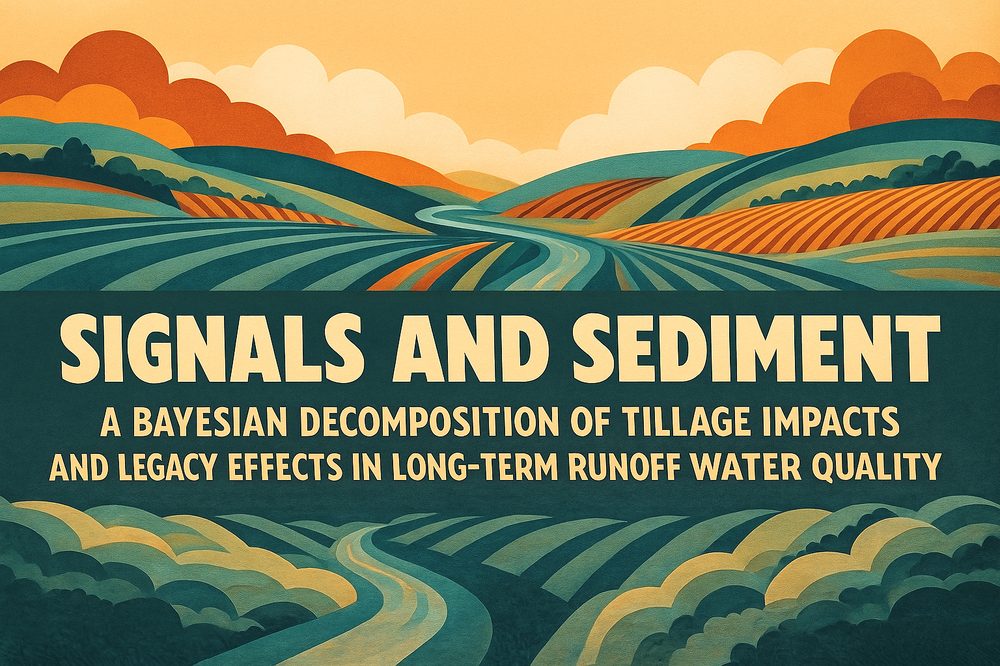
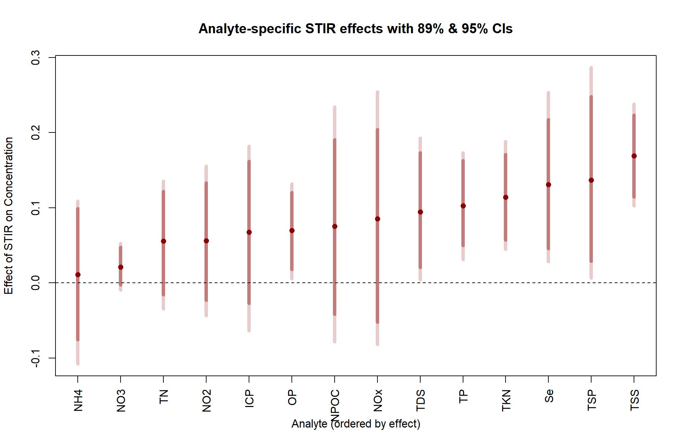
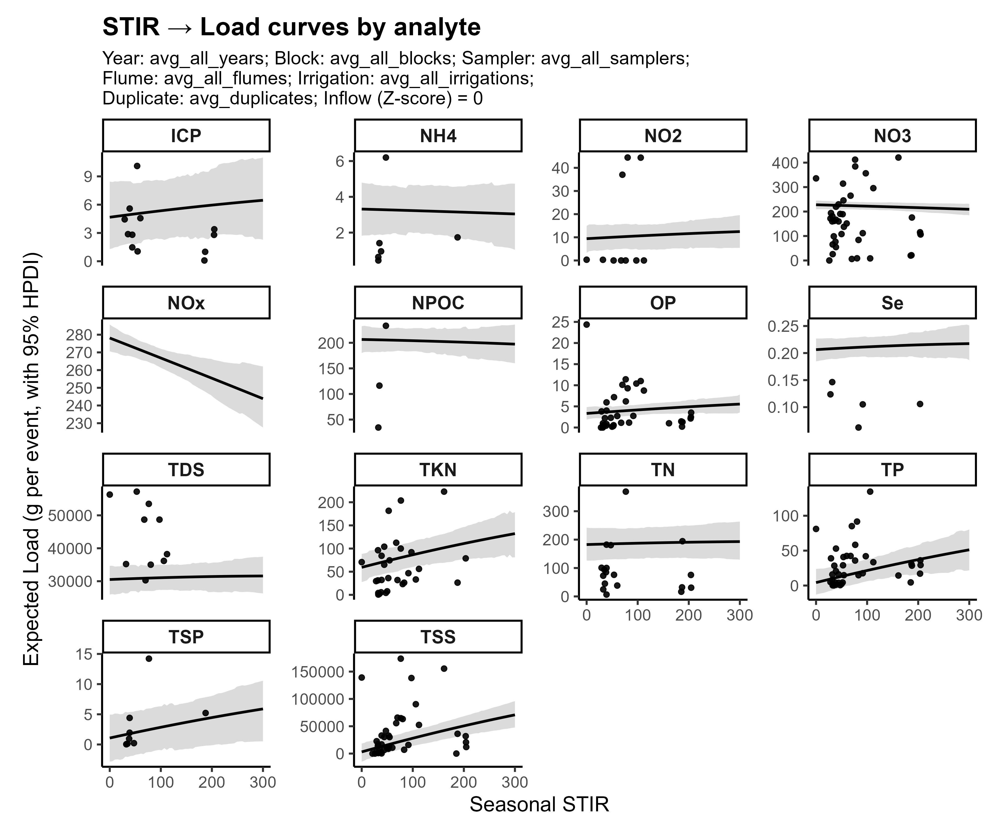
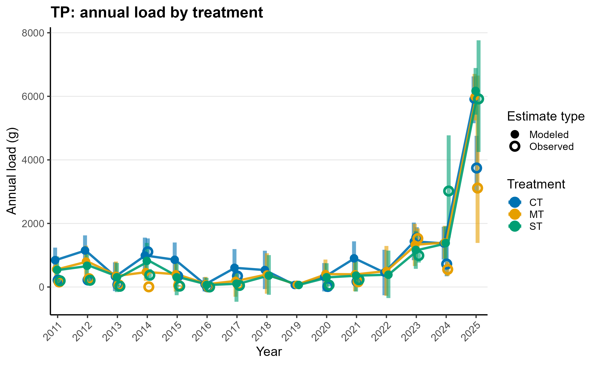
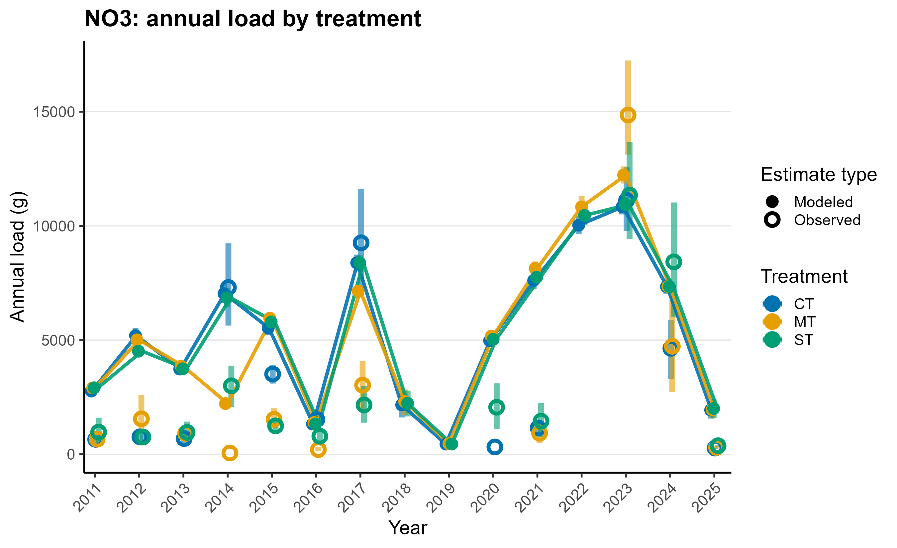
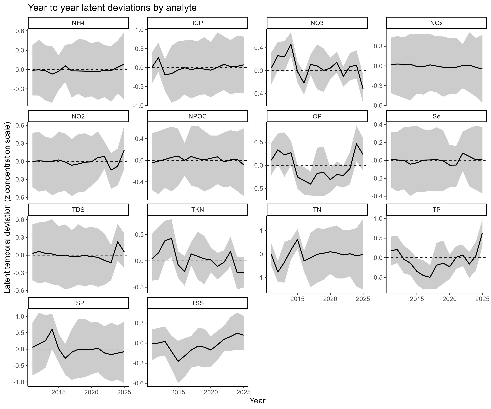
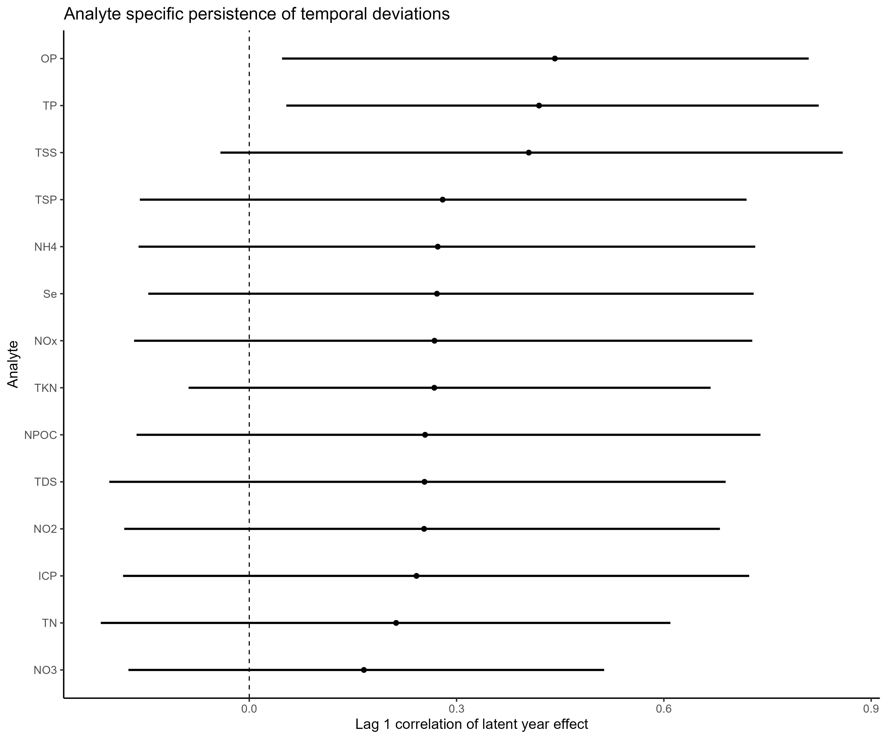
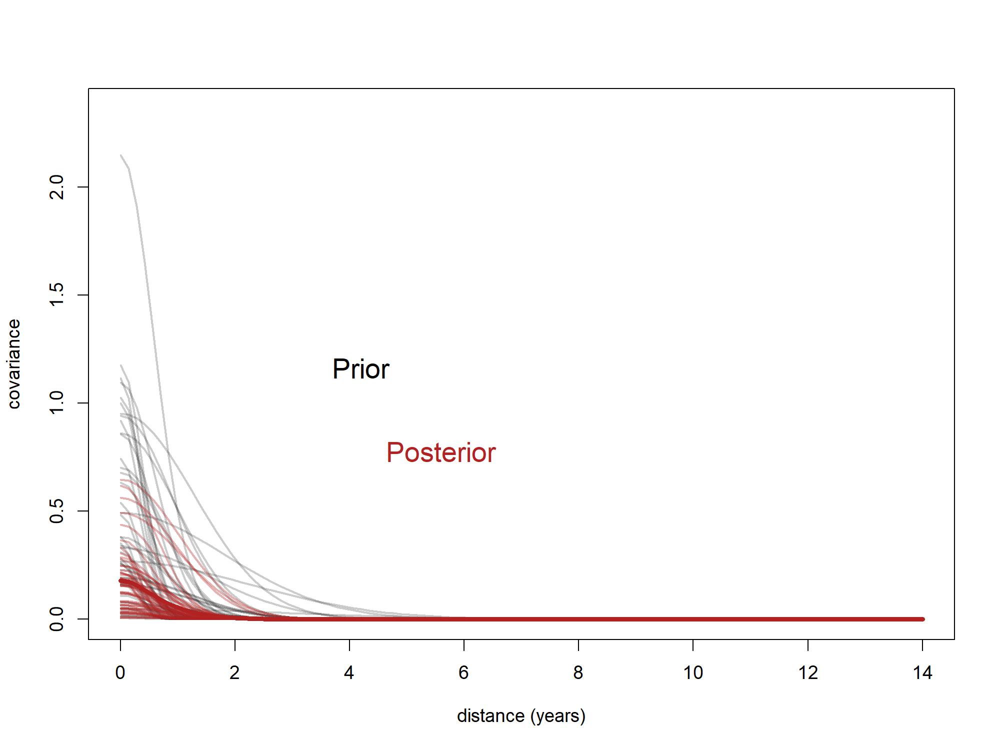
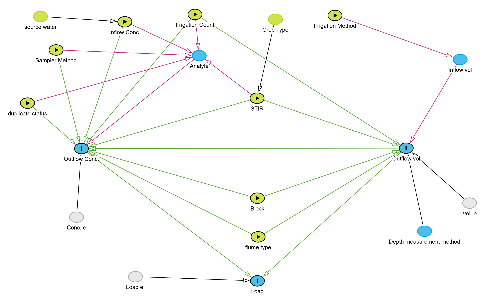

 <br/> <br/>
**Principal Investigator:**  <br/>
AJ Brown, Agricultural Data Scientist  <br/>
CSU Agricultural Water Quality Program <br/>
Ansley.Brown@colostate.edu

---

## Executive Summary

This repository integrates a complete **Python preprocessing pipeline** with a **Bayesian hierarchical modeling framework in R** to evaluate long-term tillage impacts on edge‑of‑field water quality at the Kerbel study site (2011–2025). The project joins **concentration**, **flow**, **crop management**, and **soil disturbance (STIR)** data into a unified analytical workflow.

Key scientific findings from the Bayesian multi‑output Gaussian process model include:

* **STIR increases outflow concentrations for most analytes**, particularly particulate nutrients and sediment-associated species.  
* **STIR → Load relationships** show positive associations for many analytes once both flow and concentration uncertainties are propagated.  
* **Temporal deviations** exhibit analyte-specific structure, with **strong multi‑year persistence** for particulate nutrient forms and weaker persistence for dissolved species.  
* The **shared GP kernel** indicates short-range temporal correlation, while analyte-level deviations reveal distinct ecological responses.  
* DAG-based adjustment ensures causal interpretability of STIR effects.

Figures summarizing these results are embedded below.

---

## Repository Structure

```
kerbel-long-term-impacts/
│
├── LICENSE
├── README.md
│
├── code/
│   ├── main.py
│   ├── wq_longify.py
│   ├── stir_pipeline.py
│   ├── merge_wq_stir_by_season.py
│   ├── dag.r, dag2_23July2025.r
│
├── data/
│   ├── Master_WaterQuality_Kerbel_LastUpdated_10272025.csv
│   ├── tillage_records.csv
│   ├── tillage_mapper_input.csv
│   ├── crop records.csv
│   └── STIR_values_MOSES_2023_data.csv
│
├── docs/
│   ├── STIR calculations.md
│   ├── README_final_outputs.md
│   └── Farming Implements presentation slides.pdf
│
├── figs/
│
└── out/
    ├── kerbel_master_concentrations_long.csv
    ├── stir_events_long.csv
    ├── wq_with_stir_by_season.csv
    └── wq_with_stir_unmatched.csv
```

---

## Pipeline Summary

### Step A — Water-Quality Longification (`wq_longify.py`)
Converts the master WQ file into tidy long format (one row per analyte per event).

### Step B — STIR Computation (`stir_pipeline.py`)
Calculates event-level, daily, and cumulative STIR values using MOSES/NRCS parameters and field tillage logs.  
Full details in `docs/STIR calculations.md`.

### Step C — Season Merge (`merge_wq_stir_by_season.py`)
Attaches seasonal and cumulative STIR to WQ samples.

---

## Running the Full Pipeline

```
cd "C:/Users/ansle/OneDrive/Documents/GitHub/kerbel-long-term-impacts"
python code/main.py --debug
```

The runner executes all tasks, producing cleaned, merged datasets in the `out/` folder.

---

## Bayesian Modeling Framework

The long-term tillage impacts analysis uses a **hierarchical Bayesian model** constructed in *Stan* and fit via the `ulam` interface from *rethinking*, customized to handle the multi-analyte, multi-level, multi-year structure of the Kerbel dataset. The goals of the model are to:

1. quantify analyte-specific effects of seasonal tillage disturbance (STIR),
2. propagate all key measurement-error sources into posterior uncertainty,
3. account for repeated-measures dependence across blocks, samplers, flumes, irrigation events, and years, and
4. estimate the temporal correlation (“persistence”) of latent water-quality deviations across the 14-year panel.

## Model Structure

## 1. Observation Model

For each observation (i), the outflow concentration of analyte (a) is modeled on a standardized scale as

```math
C_i \sim \mathrm{Normal}(\mu_i, \sigma_{a}),
```

where (\sigma_a) is analyte-specific residual variance.

The linear predictor combines fixed and random effects:

```math
\mu_i = 
\alpha_a
+ \beta^{(STIR)}_a \, S_i
+ \beta^{(CIN)}_a \, \text{CIN}_i
+ \beta^{(VOL)}  \, V_i
+ \beta^{(IRR)}  \, \text{IRR}_i
+ \beta^{(DUP)}_a \, \text{DUP}_i
+ \gamma^{(B)}_{a,B_i}
+ \gamma^{(S)}_{a,S_i}
+ \gamma^{(F)}_{a,F_i}
+ f_{a,\,Y_i}.
```

The final term (f_{a,Y_i}) is the **latent temporal effect** for analyte (a) in year (Y_i), drawn from a separable multi-output Gaussian Process.

---

## 2. Hierarchical Structure Across Analytes

To share information across analytes without forcing identical responses, the model uses analyte-level multivariate priors:

```math
(\alpha_a, 
 \beta^{(STIR)}_a, 
 \beta^{(CIN)}_a, 
 \beta^{(DUP)}_a )^\top
\sim 
\mathrm{MVN}(\boldsymbol{\mu}, \Sigma_A),
```

with non-centered parameterization:

```math
v_A = L_A \, \text{diag}(\sigma_A) \, Z_A,
```

where (Z_A) are i.i.d. standard Normal draws, and (L_A) is a Cholesky factor of the analyte correlation matrix.
This specification allows analytes with few measurements to borrow strength from better-observed analytes.

---

## 3. Random Effects for Block, Sampler, and Flume

Block (replication), sampler method, and flume type each introduce systematic differences in measured concentration.
We model these as:

```math
\gamma^{(B)}_{a,b} \sim \mathrm{MVN}(0, \Sigma_B), \quad
\gamma^{(S)}_{a,s} \sim \mathrm{MVN}(0, \Sigma_S), \quad
\gamma^{(F)}_{a,f} \sim \mathrm{MVN}(0, \Sigma_F),
```

with analyte-specific covariance.
This ensures that sampler or flume biases affecting some analytes more strongly than others are coherently estimated.

---

## 4. Explicit Modeling of Measurement Error

Both inflow concentration (CIN) and runoff volume (VOL) contain missing values and instrument uncertainty.
Each is imputed through a simple measurement-error model:

```math
\text{CIN}_i^{\text{obs}} \sim \mathrm{Normal}(0, 1),
```

```math
V_i^{\text{obs}} \sim \mathrm{Normal}(a_V + b_V \, S_i, \sigma_V).
```

This forces uncertainty in CIN and VOL to **propagate into the posterior of analyte concentrations and load predictions**, instead of treating them as fixed known covariates.

---

## 5. Multi-Output Gaussian Process for Temporal Dependence

The year-to-year latent deviations (f_{a,Y}) are modeled using a **separable Gaussian Process**:

```math
f \sim \mathrm{GP}(0, \Sigma_A \otimes K_{\text{year}}),
```

where

* (K_{\text{year}}) captures temporal correlation across years,
* (\Sigma_A) captures cross-analyte covariance,
* (\otimes) indicates the Kronecker product.

### Temporal Covariance Kernel

We use a squared-exponential kernel:

```math
K_{\text{year}}(t_i,t_j) = \eta^2 \exp[-\rho \,(t_i - t_j)^2].
```

Priors:

```math
\eta \sim \mathrm{Exponential}(2), \qquad
\rho \sim \mathrm{Exponential}(0.5).
```

These priors allow both strong persistence (slow decay) and near independence (rapid decay), letting the data decide how stable analyte deviations are across time.

### Interpretation

* Large (\eta) indicates **substantial between-year variation**.
* Small (\rho) corresponds to **long-term persistence**, where deviations last several years.
* Large (\rho) shrinks toward **year-to-year independence**.

Posterior draws show a **substantial contraction** relative to the prior, indicating that the long-term dataset strongly informs the temporal correlation structure.

---

## 6. Posterior Simulation of Load Curves

Posterior load predictions use:

```math
\text{Load}_{i,a} = 
C_{i,a}^{\text{raw}} \times V_i^{\text{raw}} / 1000,
```

with concentration and volume transformed back to raw scale using:

```math
C^{\text{raw}} = \bar{C}_a + s_{C,a} \, C_i,
```

```math
V^{\text{raw}} = \bar{V} + s_V \, V_i.
```

The generative functions compute posterior predictive distributions for load under arbitrary STIR scenarios, averaging or conditioning on sampler, block, flume, irrigation, duplicate status, or year.

---

## 7. Summary of Bayesian Workflow Principles

This modeling approach follows best practices from the *Statistical Rethinking* framework:

1. **Non-centered parameterization** to improve sampler efficiency.
2. **Hierarchical pooling** to stabilize estimates for seldom-observed analytes.
3. **Explicit measurement-error modeling** to propagate uncertainty.
4. **Gaussian Process priors** to capture smooth temporal structure.
5. **Posterior predictive simulation** for direct interpretation of STIR effects on concentration and load.

Together, these components produce a coherent inference framework that simultaneously:

* accounts for uncertainty,
* respects the hierarchical data structure,
* isolates STIR effects from confounding factors, and
* quantifies analyte-specific long-term behavior in water quality under contrasting tillage systems.


## Results and Discussion
In summary:

* Certain analytes seem to be very impacted by tillage (STIR)
  * TP, TSS, OP, TKN primarily
* There are temporal effects that persist between years
  * For TP, TSS, OP, and TKN
* Key theme: Solubility!
* The Bayes model predictive ability performed best to worst in the same order as STIR analyte effect
* Bayes also let us predict annual loads, even in years with no data, with honest uncertainty

### 1. STIR Effects on Concentration



These results show **positive STIR slopes** for most analytes, with strongest effects for sediment-associated constituents.

---

### 2a. STIR → Load Relationships



Posterior predictive load curves indicate increasing event-scale loads with increasing seasonal STIR, especially for particulate species.

---

### 2b. Annual Load Summaries

Annual TP load summaries show good agreement between observed and modeled loads across treatments and years, with uncertainty intervals reflecting all propagated sources of error.


NO3 loads exhibit more variability and less predictive accuracy, likely due to the weaker relationship with STIR.

### 3. Latent Year-to-Year Deviations (Multi-Output GP)



The multi-output GP reveals analyte-specific baseline shifts after adjusting for all covariates. Particulate nutrients show clear multi-year structure.

---

### 4. Persistence of Temporal Deviations (Lag-1 Autocorrelation)



Particulate analytes (TP, OP, TKN, TSS) show **moderate to strong temporal persistence**, suggesting multi-year ecological or management drivers.

---

### 5. GP Kernel: Prior vs Posterior



Posterior draws indicate strong shrinkage toward shorter-range temporal dependence compared with prior assumptions.

---

## Causal Model (DAG)



The DAG guides covariate adjustment to isolate the direct effect of STIR on outflow concentration and load.

---

## Data Documentation

Detailed schema for all output fields is in  
`docs/README_final_outputs.md`.

---

## References

* Harmel R.D. et al. (2006). *Cumulative uncertainty in measured streamflow and water-quality data for small watersheds.* *Transactions of the ASABE,* 49(3): 689-701. 
* USDA-NRCS (2023). *Revised Universal Soil Loss Equation, Version 2 (RUSLE2), Official Database V 2023-02-24.*
  [https://fargo.nserl.purdue.edu/rusle2_dataweb](https://fargo.nserl.purdue.edu/rusle2_dataweb)
* Heller, O., Chervet, A., Durand‐Maniclas, F., Guillaume, T., Häfner, F., Müller, M., ... & Keller, T. (2025). SoilManageR—An R Package for Deriving Soil Management Indicators to Harmonise Agricultural Practice Assessments. European Journal of Soil Science, 76(2), e70102. GitLab Repository: [https://gitlab.com/nrcs-soil/soilmanager](https://gitlab.com/nrcs-soil/soilmanager)

---

## License

GPL‑2. Please credit the **Colorado State University Agricultural Water Quality Program (AWQP)** when using this repository.


## TODOS
- [X] fix flume labeling so that 10V and 10 V are consistent, rerun model
- [X] add graph showing STIR impacts on runoff volume
- [ ] add table of annual load summaries by analyte and treatment over study period
- [ ] add crop type and residue cover to both concentration and volume models
