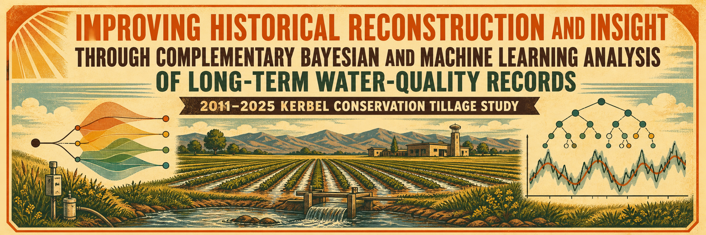

**Repository author and maintainer:** Ansley J. Brown ([ansleybrown1337](https://github.com/ansleybrown1337))

This repository contains the data, code, model specifications, results,
and figures associated with the manuscript titled, "Improving Historical 
Reconstruction and Insight Through Complementary Bayesian and Machine Learning 
Analysis of Long-Term Water-Quality Records", and is part of the dissertation
work of Ansley J. Brown. The analysis uses
the 2011–2025 Kerbel surface-irrigated conservation-tillage experiment in Fort
Collins, Colorado. Conventional tillage (CT), minimum tillage (MT), and strip
tillage (ST) are evaluated with two complementary frameworks: a hierarchical
Bayesian model for scientific inference and a CatBoost workflow for predictive
reconstruction within the observed data domain.

## Summary

Long-term edge-of-field monitoring records provide valuable evidence for
evaluating agricultural conservation practices, but incomplete observations,
changing measurement methods, and temporal heterogeneity complicate prediction
and inference. Weighted concentration interval coverage was 93.8% for Bayesian
posterior-predictive intervals and 85.5% for ML outer leave-one-year-out
prediction intervals; runoff-volume coverage was 89.0% and 86.8%, respectively.
CatBoost concentration predictions were driven primarily by analyte identity
and inflow concentration, whereas runoff-volume prediction relied most on days
since planting, day of year, cumulative STIR, measurement method, and inflow
volume. Both frameworks placed total suspended solids and total nitrogen export
highest under CT, although estimated reduction magnitudes differed. Bayesian
medians indicated that MT and ST reduced total suspended solids by 7.8% and
10.5% relative to CT, while ML estimated reductions of 36.3% and 34.9%. For
total nitrogen, Bayesian reductions were 6.9% and 4.2%, while ML reductions were
31.5% and 33.2%. Total phosphorus was less stable across frameworks. Agreement
between the frameworks strengthens management conclusions; disagreement marks
analytes and processes that require cautious interpretation.

## Release scope

The public workflow consists of:

- a shared physical-event contract defined by `Year + Irrigation + Rep + Treatment`;
- Bayes model `v3p3_physical_event`;
- machine-learning model `v3p4_physical_event`; and
- complementary Bayes/ML synthesis `v3p4_physical_event`.

Date is event metadata, not part of physical-event identity. The cleaned record
contains 528 plot-level physical events: 510 numeric-irrigation events and 18
storm events. Annual treatment estimates first sum events within each replicate
plot and then average the replicate-specific annual totals.

## Where to find outputs

| Product | Location | Contents |
| --- | --- | --- |
| Clean analysis table | `out/wq_cleaned.csv` | Reproducible merged and cleaned water-quality record |
| Data-contract audit | `results/preflight/` | Event roster, observation inventories, and blocking checks |
| Bayes summaries | `results/bayes/v3p3_physical_event/` | Compact posterior summaries, diagnostics, and fitted model object |
| ML summaries | `results/ml/v3p4_physical_event/` | LOYO diagnostics, feature importance, compact predictions, and saved CatBoost models |
| Complementary synthesis | `results/comparison/v3p4_physical_event/` | Publication tables comparing the two analytical frameworks |
| Figures | `figures/{bayes,ml,comparison}/` | Current model-specific and synthesis figures |

Large chain CSVs and draw-level ledgers are intentionally excluded from Git.
They are regenerated by the model workflows and are not required to inspect the
released summaries.

## Reproduce the analysis

Create the Python environment from `environment/environment_wq_ml.yml`, then
run commands from the repository root.

```powershell
conda env create -f environment/environment_wq_ml.yml
conda activate wq_ml
python code/pipeline/run_pipeline.py
python code/shared/audit_physical_events.py --input out/wq_cleaned.csv --output-dir results/preflight
```

Run the Bayesian workflow in R with CmdStan installed:

```powershell
Rscript code/bayes/stir-bayes-load_v3p3_physical_event.R
```

Run the ML and synthesis workflows:

```powershell
python code/ml/ml_catboost_conformal_loyo_v3p4_physical_event.py --repo .
python code/comparison/bayes_ml_comparison_v3p4_physical_event.py --repo .
```

The model-fitting stages are computationally intensive. The included fitted
objects and compact outputs support inspection and selected post-processing
without refitting. See the workflow documents for exact contracts and options:

- [Data units](docs/methods/data_unit_dictionary.md)
- [Physical-event methods](docs/methods/physical_event_methods.md)
- [Seasonal STIR methods](docs/methods/STIR_calculations.md)
- [Bayesian priors](docs/methods/bayesian_priors.md)
- [Data pipeline](docs/workflows/pipeline_reference.md)
- [Bayes workflow](docs/workflows/bayes_v3p3_physical_event.md)
- [ML workflow](docs/workflows/ml_v3p4_physical_event.md)
- [Complementary synthesis](docs/workflows/comparison_v3p4_physical_event.md)

## Diagnostic qualification

The saved Bayes fit produced the reported posterior summaries but is not fully
converged: 20 finite parameters had R-hat greater than 1.04 (maximum 1.068), and
28 divergent transitions were recorded. These diagnostics should accompany
interpretation of Bayesian estimates and are retained in the released results.

## Citation and license

Author and citation metadata are in [CITATION.cff](CITATION.cff). Add the final
article DOI and archived-release DOI after publication. Code is licensed under
GPL-2.0-only; see [LICENSE](LICENSE).

Repository contact: Ansley J. Brown, Colorado State University Agricultural
Water Quality Program.
