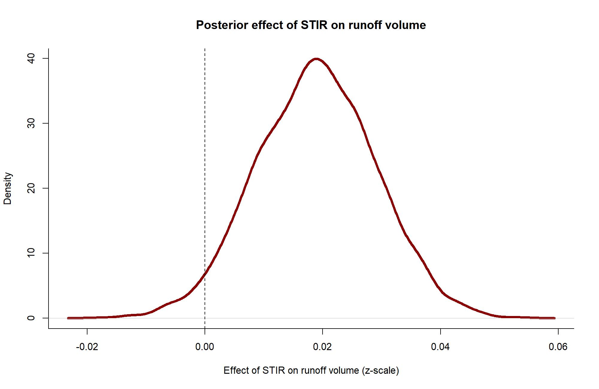
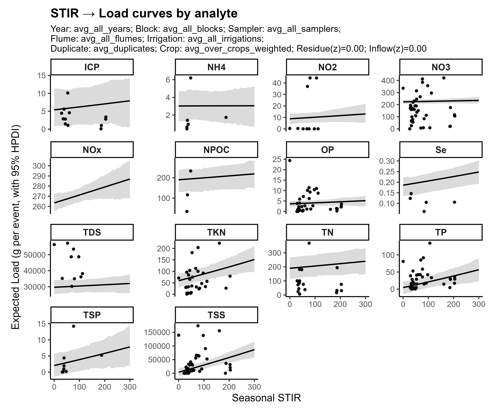
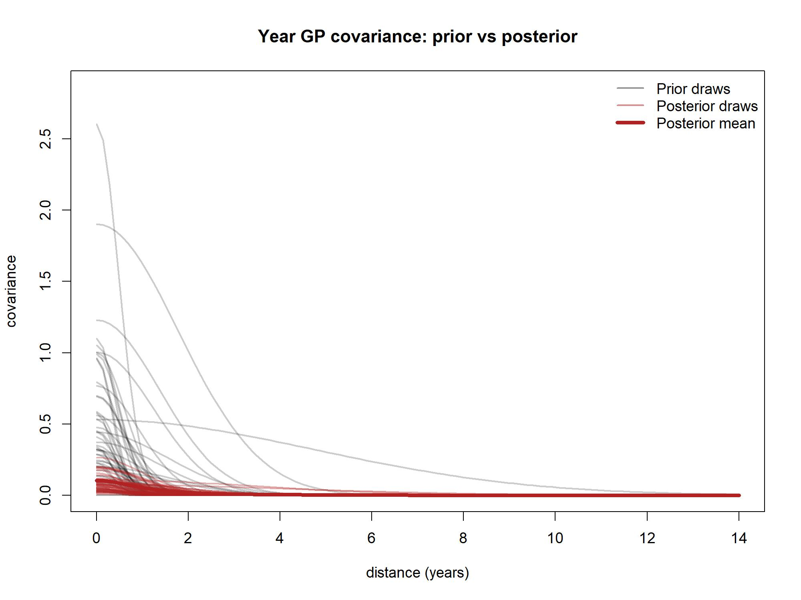

# Bayesian Modeling Framework for Kerbel Long-Term Impacts on Edge-of-Field Water Quality

This document provides full technical documentation for the **hierarchical Bayesian modeling framework** used to analyze long-term (2011–2025) edge-of-field (EoF) water-quality responses to tillage disturbance (STIR) at the Kerbel agricultural research site. It is intended to serve as a methods appendix–level reference for manuscripts and dissertation chapters.

**GitHub math rendering note:** equations are written using GitHub-compatible LaTeX (`$...$`, `$$...$$`).

---

## 1. Modeling objectives

The Bayesian models are constructed to:

1. Quantify analyte-specific causal effects of tillage intensity (STIR) on runoff concentration, volume, and load  
2. Propagate measurement uncertainty in concentration and volume through to annual loads  
3. Separate management signals from sampler, laboratory, and infrastructure artifacts  
4. Share information across analytes using hierarchical partial pooling  
5. Capture multi-year temporal persistence and correlation across analytes  
6. Enable principled imputation of missing years with uncertainty that grows appropriately  

---

## 2. Causal structure and DAG

The modeling framework is grounded in an explicit causal directed acyclic graph (DAG), developed using agronomic knowledge and monitoring design constraints.

### Key causal assumptions

- Tillage intensity (STIR) influences soil disturbance and surface condition, which affects runoff generation and particulate transport.
- Runoff volume mediates a substantial portion of load variability.
- Inflow concentration affects outflow concentration but is not affected by STIR at the field edge (conditional on design and timing).
- Measurement method, sampler, flume, and laboratory introduce systematic but non-causal variation.

### Conceptual DAG

This repository stores the DAG figure under `figs/` at the repository root.  
If this Markdown file is located under `docs/`, image links must go up one directory:

---

## 3. Observation model (outflow concentration)

For analyte $a$ and event $i$, the observed outflow concentration is modeled as:

$$
C_{i,a} \sim \mathrm{Normal}(\mu_{i,a},\, \sigma_a)
$$

where $\sigma_a$ is an analyte-specific residual standard deviation.

The linear predictor is:

$$
\mu_{i,a} =
\alpha_a
+ \beta_{\mathrm{STIR},a}\, \mathrm{STIR}_i
+ \beta_{\mathrm{inflow},a}\, \log(\tilde{C}^{\mathrm{in}}_{i})
+ \beta_{\mathrm{vol},a}\, \log(\tilde{V}_{i})
+ \mathbf{Z}_{i}\, \boldsymbol{\gamma}_a
+ f_a(\mathrm{Year}_i)
$$

where:

- $\tilde{C}^{\mathrm{in}}_{i}$ is the latent (true) inflow concentration for event $i$
- $\tilde{V}_{i}$ is the latent (true) runoff volume for event $i$
- $\mathbf{Z}_{i}$ is a design matrix for categorical factors (sampler, flume, lab, replication, and other indicators)
- $\boldsymbol{\gamma}_a$ are analyte-specific coefficients for those categorical factors
- $f_a(\cdot)$ is a year-specific latent deviation for analyte $a$ (Gaussian process, Section 7)

---

## 4. Measurement-error submodels

Observed inflow concentration and runoff volume are treated as noisy measurements of latent true values:

$$
\log\left(C^{\mathrm{in,obs}}_{i}\right)
\sim \mathrm{Normal}\left(\log\left(\tilde{C}^{\mathrm{in}}_{i}\right),\, \tau_C\right)
$$

$$
\log\left(V^{\mathrm{obs}}_{i}\right)
\sim \mathrm{Normal}\left(\log\left(\tilde{V}_{i}\right),\, \tau_V\right)
$$

This structure ensures uncertainty in measured covariates propagates forward into concentration and load estimates rather than being implicitly ignored.

---

## 5. Hierarchical analyte structure (partial pooling)

Key regression coefficients are modeled hierarchically across analytes:

$$
\boldsymbol{\beta}_a \sim \mathrm{MVN}(\boldsymbol{\mu}_{\beta},\, \Sigma_{\beta})
$$

where $\boldsymbol{\beta}_a$ includes (at minimum) the STIR, inflow, and volume effects for analyte $a$, and $\Sigma_{\beta}$ captures cross-analyte covariance. This allows strong analytes (for example TSS, TP) to inform weaker ones without forcing identical behavior.

---

## 6. Random effects for monitoring artifacts

Random intercepts are included for multiple non-causal sources of variation. For a factor level $j$ (for example lab, sampler, flume, replication), we write:

$$
\alpha_{a,j} = \alpha_a + u_{a,j}
$$

and collect random effects into a vector with multivariate structure:

$$
\mathbf{u}_{a} \sim \mathrm{MVN}(\mathbf{0},\, \Sigma_u)
$$

This formulation supports analyte-specific sensitivity to sampling and infrastructure differences and allows correlated deviations across analytes.

---

## 7. Temporal structure: multi-output Gaussian process

Year-to-year latent deviations are modeled using a separable multi-output Gaussian process:

$$
\mathbf{f}(y) \sim \mathrm{GP}\left(\mathbf{0},\, \Sigma_A \otimes K_{\mathrm{year}}\right)
$$

where:

- $\Sigma_A$ is an analyte-to-analyte covariance matrix
- $K_{\mathrm{year}}$ is a kernel over years (for example squared-exponential)

A common kernel choice is the squared-exponential:

$$
K_{\mathrm{year}}(y, y') = \eta^2\, \exp\left(-\frac{(y-y')^2}{2\ell^2}\right)
$$

This structure allows analytes to share temporal information and enables principled interpolation across missing years.

---

## 8. Prior distributions

Priors are weakly informative and scaled to the log-transformed data.

### Regression coefficients

$$
\boldsymbol{\mu}_{\beta} \sim \mathrm{Normal}(0,\, 1)
$$

### Standard deviations

$$
\sigma \sim \mathrm{Half\text{-}Normal}(0,\, 1)
$$

### Correlation and covariance structure (LKJ)

A standard decomposition is:

$$
\Sigma = \mathrm{diag}(\boldsymbol{\sigma})\, \Omega\, \mathrm{diag}(\boldsymbol{\sigma}),
\qquad
\Omega \sim \mathrm{LKJcorr}(\zeta)
$$

with $\zeta = 2$ used as a mild regularizer toward weaker correlations.

---

## 9. Posterior load generation

Event-scale loads are computed as:

$$
L_{i,a} = C_{i,a}\, V_i
$$

Annual loads are obtained by summing posterior predictive draws within year × treatment × analyte groups, preserving uncertainty:

$$
L_{y,t,a} = \sum_{i \in (y,t,a)} L_{i,a}
$$

This produces annual distributions suitable for direct comparison between modeled and observed annual loads and for uncertainty-aware trend assessment.

---

## 10. Computation and inference

- Models are implemented in **Stan** and compiled via `cmdstanr`.
- Posterior sampling is performed using **Hamiltonian Monte Carlo (HMC)** with the **No-U-Turn Sampler (NUTS)**.
- Typical fits involve on the order of tens of thousands of parameters and thousands to tens of thousands of observations, depending on model version.
- Convergence is assessed using $\hat{R}$, effective sample size, trace diagnostics, and posterior predictive checks.

Model versions are tracked in: [`docs/bayes-model_versions.md`](./bayes-model_versions.md)

---

## 11. Relationship to the machine-learning analysis

Bayesian models provide explicit causal interpretability (via the DAG and generative structure), time-evolving uncertainty, and principled handling of missing data (imputation with widening uncertainty).

Machine-learning models are used strictly as a benchmark for pattern learning, not for causal inference.

---

## 12. Graphical results (representative)

All figures below are stored under `figs/` at the repository root.  
If this Markdown file is stored under `docs/`, the correct relative path is `../figs/...`.

### STIR effects on runoff volume

### Annual load curves conditioned on STIR

### Year-to-year latent deviations

### Year covariance structure

---

## 13. References

Harmel, R.D., Cooper, R.J., Slade, R.M., Haney, R.L., & Arnold, J.G. (2006). Cumulative uncertainty in measured streamflow and water-quality data for small watersheds. *Transactions of the ASABE*, 49(3), 689–701.

USDA-NRCS. (2023). Revised Universal Soil Loss Equation (RUSLE2) documentation and methodology.
